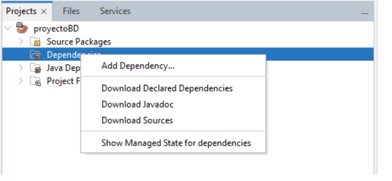
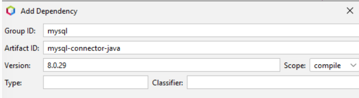

# ***TEMA 8 GESTIÓN DE BASE DE DATOS***

## ***AÑADIR EL DRIVER AL PROYECTO***





## ***ESTABLECER CONEXIÓN CON PATRÓN SINGLETON***

```java
public class AccesoBaseDatos {

    private Connection conn = null; //atributo conexión
    // constantes a definir
    private static final String BD = "ejemplo";
    private static final String USUARIO = "conexion";
    private static final String CLAVE = "";
    private static final String URL = "jdbc:mysql://localhost:3306/" + BD;

    private AccesoBaseDatos() {

        try {
            Properties properties = new Properties();
            properties.setProperty("user", USUARIO);
            properties.setProperty("password", CLAVE);
            properties.setProperty("useSSL", "false");
            properties.setProperty("autoReconnect", "true");
            conn = (Connection) DriverManager.getConnection(URL, properties);
            if (conn == null) {
                System.out.println("Error en conexion");
            } else {
                System.out.println("Conexion correcta a: " + URL);
            }
        } catch (SQLException ex) {
            // handle any errors
            System.out.println("SQLException: " + ex.getMessage());
            System.out.println("SQLState: " + ex.getSQLState());
            System.out.println("VendorError: " + ex.getErrorCode());
        }
    }

    public static AccesoBaseDatos getInstance() {
        return AccesoBaseDatosHolder.INSTANCE;
    }

    private static class AccesoBaseDatosHolder {

        private static final AccesoBaseDatos INSTANCE = new AccesoBaseDatos();
    }


//obtener la conexion
    public Connection getConn() {
        return conn;
    }
// cerrar la conexión

    public boolean cerrar() {
        boolean siCerrada = false;
        try {
            conn.close();
            if (conn.isClosed()) {
                siCerrada = true;
            }
        } catch (SQLException sqe) {
            System.out.println("Se produjo un error en el cierre");
        }
        return siCerrada;
    }
```

## ***SENTENCIAS DE CREAR Y EJECUTAR SENTENCIAS***

Crear una tabla

```java
Statement sentencia = null;
        try {
            Connection conn = AccesoBaseDatos.getInstance().getConn();//único punto de acceso
            sentencia = conn.createStatement();
            // en String tabla codigo sql con el create table
            String tabla = "create table productos(\n"
                    + "  id smallint NOT NULL AUTO_INCREMENT,\n"
                    + "  nombre varchar(40) NOT NULL,\n"
                    + "  cantidad int NOT NULL,\n"
                    + "  PRIMARY KEY (`id`)\n"
                    + ") ENGINE=InnoDB AUTO_INCREMENT=12 DEFAULT CHARSET=utf8mb4 ";
            sentencia.executeUpdate(tabla);
            System.out.println("Tabla producto creada con éxito!!");

        } catch (SQLException ex) {
            System.out.println("Error al ejecutar la creacion de tabla " + ex.getMessage());
        } finally {
            try {
                if (sentencia != null) {
                    sentencia.close();
                }
            } catch (SQLException ex) {
                System.out.println("Error al cerrar la sentencia " + ex.getMessage());
            }

        }
```
Insertar Datos

```java
 Connection conn = AccesoBaseDatos.getInstance().getConn();
        try ( Statement sentencia = conn.createStatement();) {
            // dentro de executeUpdate codigo del insert, update o delete
            String inserta = "INSERT INTO productos"
                    + "(nombre,cantidad)"
                    + "VALUES ('manzanas',18),"
                    + "('kiwis',22),('naranjas',23),('piñas', 9)";
            int resul = sentencia.executeUpdate(inserta);
            if (resul == 4) {
                System.out.println("Filas afectadas: " + resul);
            } else {
                throw new Exception("error no se han insertado todos los registros");
            }
        } catch (SQLException ex) {
            System.out.println("Error en la inserción de datos " + ex.getMessage());
        } catch (Exception ex) {
            System.out.println(ex.getMessage());
        }
```

## ***SENTENCIAS PREPARADAS***

Con patrón DAO, creando una interfaz repositorio

```java
public interface Repositorio<T> {
    // método para listar todos los objetos T
    // para listar todos los registros de una tabla
    public List<T> listar();
    // método para recuperar un objeto por su ID
    // nos recupera un registro de la base de datos por clave primaria
    public T porId( int id);
    // método en este caso puede ser tanto para realizar la inserción o modificación de un objeto
    // aunque también se pueden crear un método para añadir un objeto y otro para modificar
    // inserta un registro en la tabla o bien lo modifica
    public void guardar(T t);
    // método para borrar un objeto por su ID
    // nos permite borrar un registro de la base de datos por clave primaria
    public void eliminar( int  id);
}
```

### ***EJEMPLOS***

Listar

```java
 public List<Producto> listar() {
        List<Producto> productos = new ArrayList<>();
        try ( Statement stmt = getConnection().createStatement();  ResultSet rs = stmt.executeQuery("SELECT id,nombre,cantidad FROM productos");) {
            while (rs.next()) {
                Producto producto = crearProducto(rs);
                if (!productos.add(producto)) {
                    throw new Exception("error no se ha insertado el objeto en la colección");
                }
            }

        } catch (SQLException ex) {
            // errores
            System.out.println("SQLException: " + ex.getMessage());
        } catch (Exception ex) {
            System.out.println(ex.getMessage());
        }
        return productos;
    }
```
Buscar

```java
public Producto porId(int id) {
        Producto producto = null;
        String sql = "SELECT id,nombre,cantidad FROM productos WHERE id=?";
        try ( PreparedStatement stmt = getConnection().prepareStatement(sql);) {
            stmt.setInt(1, id);
            try ( ResultSet rs = stmt.executeQuery();) {
                if (rs.next()) {
                    producto = crearProducto(rs);
                }
            }

        } catch (SQLException ex) {
            // errores
            System.out.println("SQLException: " + ex.getMessage());
        }
        return p
```

Eliminar 

```java
 public void eliminar(int id) {

       String sql="DELETE FROM productos WHERE id=?";
        try ( PreparedStatement stmt = getConnection().prepareStatement(sql);) {
            stmt.setInt(1, id);
            int salida = stmt.executeUpdate();
            if (salida != 1) {
                throw new Exception(" No se ha borrado un solo registro");
            }
        } catch (SQLException ex) {
            // errores
            System.out.println("SQLException: " + ex.getMessage());
        } catch (Exception ex) {
            System.out.println(ex.getMessage());
        }
    }
```

Insertar

```java
  public void insertar(Usuario t) {
        String sql = "INSERT into usuarios(username,password,email)VALUES(?,?,?)";
        try (PreparedStatement stmt = getConnection().prepareStatement(sql);) {
            stmt.setString(1, t.getUsername());
            stmt.setString(2, encriptacionMD5(t.getPassword()));
            stmt.setString(3, t.getEmail());
            int salida = stmt.executeUpdate();
            if (salida != 1) {
                throw new Exception(" No se ha insertado el registro");
            }
        } catch (SQLException s) {
            System.out.println(s.getMessage());
        } catch (Exception e) {
            System.out.println(e.getMessage());
        }
    }
```


